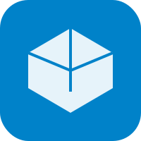
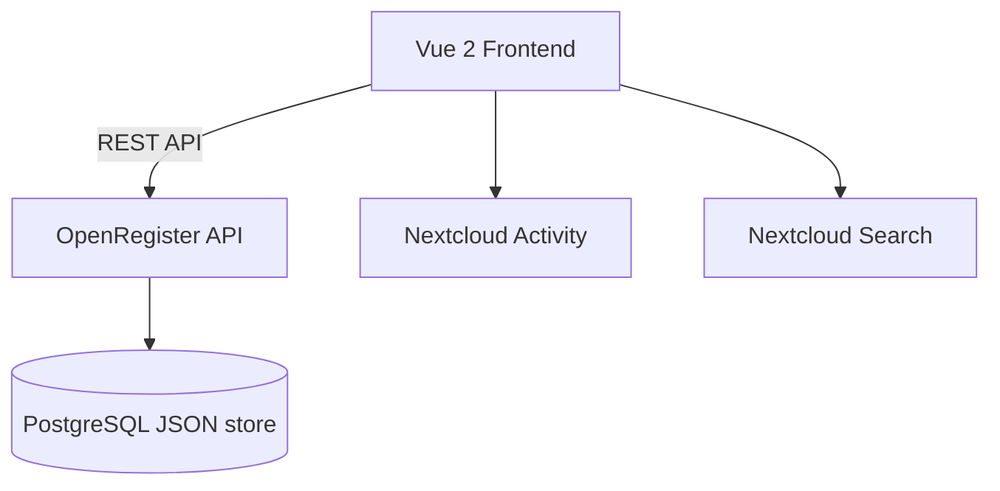

<p align="center">
  
</p>

<h1 align="center">Nextcloud App Template</h1>

<p align="center">
  <strong>A template for creating new Nextcloud apps</strong>
</p>

<p align="center">
  <a href="https://github.com/ConductionNL/nextcloud-app-template/releases"></a>
  <a href="https://github.com/ConductionNL/nextcloud-app-template/blob/main/LICENSE"></a>
  <a href="https://github.com/ConductionNL/nextcloud-app-template/actions"></a>
</p>

---

A starting point for building Nextcloud apps following ConductionNL conventions.

> **Requires:** [OpenRegister](https://github.com/ConductionNL/openregister) — all data is stored as OpenRegister objects.

## Screenshots

_Add screenshots here once the app has a UI._

## Features

Features are defined in [`appspec/features/`](appspec/features/). See the [roadmap](openspec/ROADMAP.md) for planned work.

### Core
- **Dashboard** — Personal overview page with key information at a glance
- **Admin Settings** — Configurable settings panel for administrators

### Supporting
- **OpenRegister Integration** — Pre-wired data layer using OpenRegister objects
- **Quality Pipeline** — PHPCS, PHPMD, Psalm, PHPStan, ESLint, Stylelint

## Architecture



_Update this diagram during `/app-explore` sessions as the architecture evolves._

### Data Model

| Object | Description |
|--------|-------------|
| _(define your data objects here)_ | — |

_Data model is defined using OpenRegister schemas. See [`appspec/features/`](appspec/features/) for feature-level design decisions and [`appspec/adr/`](appspec/adr/) for architectural decisions._

### Directory Structure

```
app-template/
├── appinfo/                    # Nextcloud app manifest, routes, navigation
├── lib/                        # PHP backend — controllers, settings
│   ├── AppInfo/Application.php
│   ├── Controller/DashboardController.php
│   ├── Settings/AdminSettings.php
│   └── Sections/SettingsSection.php
├── templates/                  # PHP templates (SPA shells)
├── src/                        # Vue 2 frontend
│   ├── main.js                 # App entry point
│   ├── settings.js             # Admin settings entry
│   ├── App.vue                 # Root component
│   ├── router/                 # Vue Router
│   ├── store/                  # Pinia stores
│   └── views/                  # Route-level views
├── appspec/                    # App configuration and specification
│   ├── app-config.json         # Canonical app config (id, goal, dependencies, CI)
│   ├── features/               # High-level feature definitions
│   └── adr/                    # Architectural Decision Records
├── openspec/                   # Implementation specifications and roadmap
│   ├── ROADMAP.md              # Product roadmap
│   └── changes/                # OpenSpec change directories
├── .github/workflows/          # CI/CD pipelines
├── phpcs-custom-sniffs/        # Named parameters enforcement
├── img/                        # App icons and screenshots
└── l10n/                       # Translations (en, nl)
```

## Requirements

| Dependency | Version |
|-----------|---------|
| Nextcloud | 28 – 33 |
| PHP | 8.1+ |
| Node.js | 20+ |
| [OpenRegister](https://github.com/ConductionNL/openregister) | latest |

## Installation

### From the Nextcloud App Store

1. Go to **Apps** in your Nextcloud instance
2. Search for **Nextcloud App Template**
3. Click **Download and enable**

> OpenRegister must be installed first. [Install OpenRegister →](https://apps.nextcloud.com/apps/openregister)

### From Source

```bash
cd /var/www/html/custom_apps
git clone https://github.com/ConductionNL/nextcloud-app-template.git app-template
cd app-template
npm install && npm run build
php occ app:enable app-template
```

## Development

### Start the environment

```bash
docker compose -f openregister/docker-compose.yml up -d
```

### Frontend development

```bash
npm install
npm run dev        # Watch mode
npm run build      # Production build
```

### Code quality

```bash
# PHP
composer check:strict   # All quality checks (PHPCS, PHPMD, Psalm, PHPStan, tests)
composer cs:fix         # Auto-fix PHPCS issues
composer phpmd          # Mess detection
composer phpmetrics     # HTML metrics report

# Frontend
npm run lint            # ESLint
npm run stylelint       # CSS linting
```

### Enable locally

```bash
docker exec nextcloud php occ app:enable app-template
```

## Tech Stack

| Layer | Technology |
|-------|-----------|
| Frontend | Vue 2.7, Pinia, @nextcloud/vue |
| Build | Webpack 5, @nextcloud/webpack-vue-config |
| Backend | PHP 8.1+, Nextcloud App Framework |
| Data | OpenRegister (PostgreSQL JSON objects) |
| UX | @conduction/nextcloud-vue |
| Quality | PHPCS, PHPMD, Psalm, PHPStan, ESLint, Stylelint |

## Branches

| Branch | Purpose |
|--------|---------|
| `main` | Stable releases — triggers release workflow |
| `beta` | Beta / pre-release builds |
| `development` | Active development — merge target for feature branches |

## Documentation

| Resource | Description |
|----------|-------------|
| [`appspec/`](appspec/) | App configuration, features, and architectural decisions |
| [`appspec/features/`](appspec/features/) | Feature definitions and lifecycle status |
| [`appspec/adr/`](appspec/adr/) | Architectural Decision Records |
| [`openspec/ROADMAP.md`](openspec/ROADMAP.md) | Product roadmap |
| [`openspec/`](openspec/) | Implementation specifications |

## Standards & Compliance

- **Accessibility:** WCAG AA (Dutch government requirement)
- **Authorization:** RBAC via OpenRegister
- **Audit trail:** Full change history on all objects
- **Localization:** English and Dutch

## Related Apps

- **[OpenRegister](https://github.com/ConductionNL/openregister)** — Object storage layer (required dependency)

_Add related apps here as integrations are built._

## Support

For support, contact us at [support@conduction.nl](mailto:support@conduction.nl).

For a Service Level Agreement (SLA), contact [sales@conduction.nl](mailto:sales@conduction.nl).

## License

This project is licensed under the [EUPL-1.2](LICENSE).

### Dependency license policy

All dependencies (PHP and JavaScript) are automatically checked against an approved license allowlist during CI. The following SPDX license families are approved:

- **Permissive:** MIT, ISC, BSD-2-Clause, BSD-3-Clause, 0BSD, Apache-2.0, Unlicense, CC0-1.0, CC-BY-3.0, CC-BY-4.0, Zlib, BlueOak-1.0.0, Artistic-2.0, BSL-1.0
- **Copyleft (EUPL-compatible):** LGPL-2.0/2.1/3.0, GPL-2.0/3.0, AGPL-3.0, EUPL-1.1/1.2, MPL-2.0
- **Font licenses:** OFL-1.0, OFL-1.1

## Authors

Built by [Conduction](https://conduction.nl) — open-source software for Dutch government and public sector organizations.
